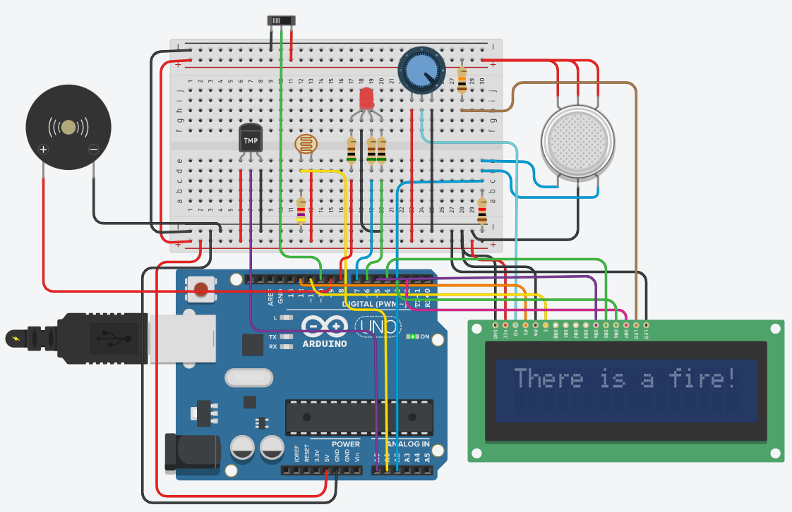

# Fire Accident Detection System using Arduino

This project focuses on the development of a Fire Accident Detection System aimed at addressing the increasing threat posed by fire incidents. It incorporates a multi-sensor approach utilizing temperature sensors, smoke sensors, and photoresistors to enhance detection accuracy. The system is designed not only to detect smoke but also to analyze increasing light intensity and temperature fluctuations associated with escalating fires. A comprehensive alarm system triggers alerts based on these parameters. The project includes a well-commented Arduino code for easy implementation, along with statistical analysis of sensor data to optimize system performance. Future enhancements may include additional sensor integration, remote monitoring features, and machine learning algorithms for advanced fire prediction.

## Features
- Multi-Sensor Approach: The detection system utilizes temperature sensors, smoke sensors, and photoresistors to enhance accuracy and reliability.

- Comprehensive Alarm System: The alarm system is designed to trigger not only upon detecting smoke but also in response to heightened light intensity and temperature spikes, indicative of fire outbreaks.

- Arduino Code: A well-commented Arduino code is provided, facilitating easy implementation and customization.

- Statistical Analysis: Statistical operations are performed on the sensor output to extract meaningful insights and optimize system performance.

## Working Principles

- Case 1 - Manual Activation: In this scenario, when a fire is visually identified and the alarm is manually activated, the system responds by triggering the buzzer to sound an alarm. Additionally, the LCD screen displays the message "There is a fire!" to alert individuals in the vicinity.

- Case 2 - Automatic Detection: In this scenario, the system automatically monitors readings from the temperature sensor, smoke sensor, and photoresistor. As the fire intensifies, the luminosity, smoke levels, and temperature increase accordingly. The system is programmed with specific threshold values for each sensor. When these thresholds are exceeded, indicating the presence of a fire, the RGB bulb illuminates with varying color intensities based on the severity of the fire. Initially, the bulb emits a green light, which transitions to red as the fire escalates. Importantly, the threshold value for the photoresistor is carefully calibrated to prevent false alarms triggered by normal sunlight or artificial indoor lighting.

## Circuit Diagram 

